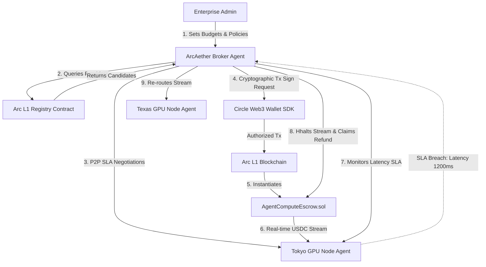

# ArcAether: Autonomous AI Compute & API Brokerage

An autonomous economic agent protocol and dashboard built for **Track 4: Best Agentic Economy Experience on Arc** for the Stablecoin Commerce Stack Challenge.

## Project Overview

**ArcAether** is a decentralized infrastructure procurement platform. In the emerging agentic economy, AI agents need to consume resources (GPU clusters, dataset APIs, vector database queries) dynamically. ArcAether enables enterprise AI agents to autonomously query node registries, negotiate rates, deploy secure USDC escrow accounts, check latency metrics, and self-heal by rerouting payment streams and workflows during SLA violations.

## Submission Details

- **Project Title:** ArcAether Compute Brokerage
- **Track Submitted For:** Best Agentic Economy Experience on Arc
- **Developer Account Email:** s.narsi26267@gmail.com
- **Circle Products Used on Arc:**
  - **USDC**: Core settlement rail for pay-as-you-use compute.
  - **Circle Web3 Wallets**: Developer-controlled & User-controlled hot wallets representing the agent credentials.
  - **Circle Gateway**: Treasury orchestration and escrow funding.
  - **Nanopayments**: Micro-tick stream of USDC fractions matching real-time compute execution.

---

## System Architecture



---

## Local Setup & Run Instructions

Since the server is built with zero external dependencies using Node.js core libraries, setup is instant and does not require internet downloads:

1. **Verify Node.js Installation**: Ensure you have Node.js installed by running:
   ```bash
   node -v
   ```

2. **Navigate to the Directory**:
   ```bash
   cd C:\Users\doodl\.gemini\antigravity\scratch\arc-aether
   ```

3. **Start the Dev Server**:
   ```bash
   node server.js
   ```

4. **Access the Interface**:
   Open [http://localhost:3000](http://localhost:3000) in your web browser.

---

## Circle Product Feedback

### 1. Why we chose these products for our use case:
Autonomous AI agents operate at extreme frequencies, conducting transactions on behalf of users automatically. Standard payment gateways (credit cards, banking rails) are manual and slow. USDC on the Arc L1 blockchain provides deterministic block finality and low-cost transaction fees. This makes pay-as-you-use micro-settlements (down to milliseconds of compute) economically and programmatically viable.

### 2. What worked well during development:
- **Predictable Cost Models**: The dollar-denominated transaction fees on Arc allow agents to calculate gas expenditure profiles ahead of execution, avoiding wallet draining during high congestion.
- **Embedded Web3 Wallets API**: Embedding developer-controlled key management allows the agent to sign transactions programmatically while the enterprise administrator retains absolute policy bounds.

### 3. What could be improved:
- **Unified Streaming Standard**: Currently, developers must write custom Solidity escrow contracts to stream USDC on-chain. An official Circle SDK or EIP-like standard for continuous token flows (similar to Sablier or Superfluid) would drastically improve developer velocity.
- **Gas Fee Delegation**: Agents need to maintain gas balances in native Arc gas tokens. Having native ERC-4337 paymaster support inside Circle Wallets out-of-the-box would allow paying gas directly in USDC.

### 4. Recommendations:
- Add a "Streaming Payment SDK" to the Circle Developer Console.
- Release a template library of agentic smart contracts (e.g., subscription vault, Oracle-driven milestone escrows).
